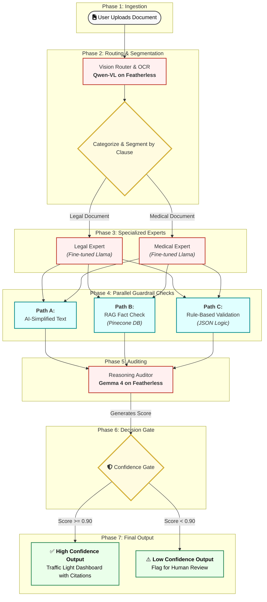

# Akhileshwar Reddy Songala
### AI Systems Architect | Mechanical Engineer by Training

---

## Systems Schematic: Router-Expert Architecture

<b>View Technical Blueprint (Mermaid.js Source)</b>

**Blueprints to Bits:** Engineering rigorous, cost-optimized agentic systems with the precision of a mechanical engineer.

---

### 🚀 Impact Metrics

---

### 🛠 Protocol & Grounding Mastery
| Protocol | Application | Result |
| :--- | :--- | :--- |
| **Model Context Protocol (MCP)** | Real-time SQL Synchronization | Zero Hallucinations in BI Reports |
| **Google ADK** | Multi-model Routing (Gemini + Ollama) | Optimal Reasoning Cost/Depth |
| **Google Gemma 4 Auditor** | Chain-of-Thought (CoT) Verification | Verified "Trust Boundary" Outputs |

---

### 📂 Case Studies: Trust Boundary Tables

#### [LegalLens AI](https://github.com/AkhileshwarReddySongala/LegalLensAI)
*Legal Document Analysis & Verification System*
| Safety Dimension | Pattern | Verification |
| :--- | :--- | :--- |
| **Grounding** | RAG-based legal context | Source attribution for all clauses |
| **Privacy** | Local processing | Zero PII leakage to external APIs |
| **Orchestration** | Router-Expert logic | Validated by Google Gemma 4 auditor |

#### [Saralytics](https://github.com/AkhileshwarReddySongala/saralytics_v1)
*Business Intelligence Agent*
| Safety Dimension | Pattern | Verification |
| :--- | :--- | :--- |
| **Logic** | Text-to-SQL via MCP | Cross-checked against schema metadata |
| **Scale** | Hybrid Cloud/Local | 50% reduction in token overhead |
| **Safety** | Trust Boundary Table | Restricted data access via ADK layers |

---

### 🏗 Technical Stack

#### Core Architectures
- **LLM Orchestration:** MCP, Google ADK, Multi-Agent Systems
- **Reasoning Patterns:** Chain-of-Thought (CoT), Reasoning Auditors
- **Data Engineering:** High-scale SQL/NoSQL Synchronization

#### Implementation Tooling
- **Backend:** Java, Python, Node.js, Flask, Express
- **Cloud/DevOps:** Google Cloud, AWS, Azure, Docker, Kubernetes, AirFlow
- **Frontend:** React, Next.js, Vanilla CSS (Blueprint Aesthetic)

---

### 🌐 Connect with the Architect

    
    
    

---
*DRWG NO: RDME-2026-001 | REV: 03 (AGENTIC) | DATE: 04 APR 2026*
